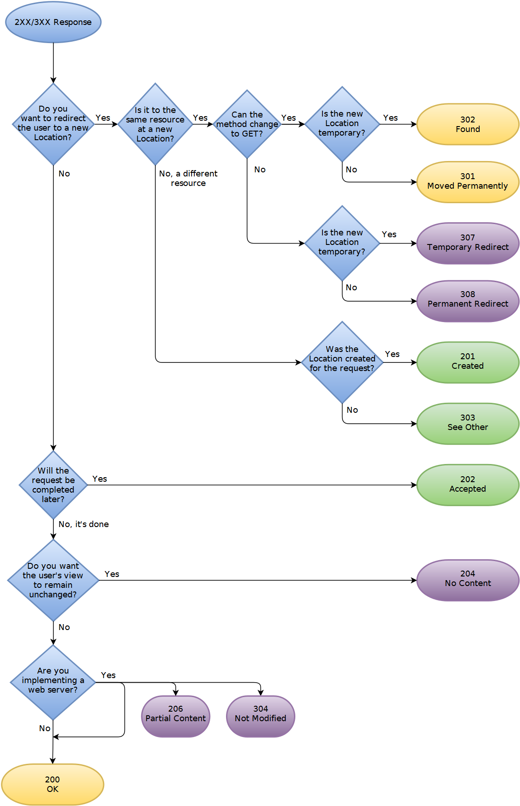

# Http

超文本传输协议，一种无状态协议

### 状态码

* 101 Switching Protocol—— 协议切换
* 300 Multiple Choices 表示该请求拥有多种可能的响应，代理或者用户自身应该从中选择一个
* 301 永久重定向
* 302 资源临时重定向，由于是临时的所以客户端在之后的请求中还应该使用原本的 URI
* 303  资源临时重定向， 常用于将 POST 请求重定向到 GET 请求，不管原请求是什么方法，重定向请求的方法都是 GET
* 307 资源临时重定向，307 状态码不允许浏览器将原本为 POST 的请求重定向到 GET 请求上
* 308 永久重定向，308 状态码不允许浏览器将原本为 POST 的请求重定向到 GET 请求上。
* 400 Bad Request 请求格式错误
* 401 **Unauthorized**
* 403 forbidden 禁止访问
* 404 Not Found
* 405  **Method Not Allowed** 表明服务器禁止了使用当前 HTTP 方法的请求。
* 500 **Internal Server Error** 服务端错误
* 501 **Not Implemented**，请求的方法不被服务器支持，因此无法被处理
* 502 **Bad Gateway**，表示作为网关或代理角色的服务器，从上游服务器中接收到的响应是无效的
* 503 **Service Unavailable**，表示服务器尚未处于可以接受请求的状态。
* 504 **Gateway Timeout** ，表示扮演网关或者代理的服务器无法在规定的时间内获得想要的响应。
* 505 **HTTP Version Not Supported** 服务器不支持请求所使用的 HTTP 版本。

##### 重定向图解

