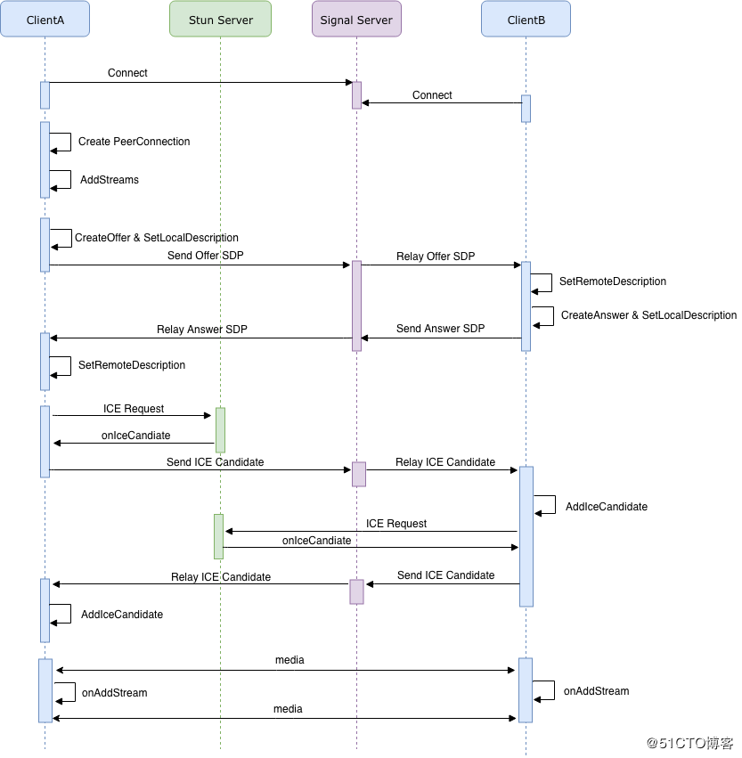
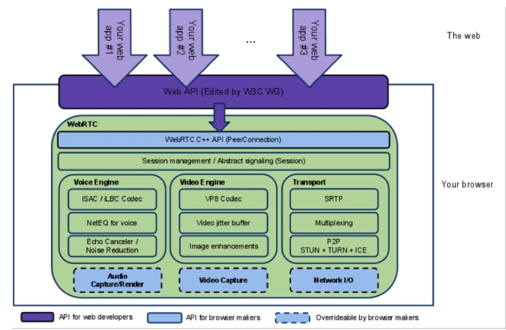

# WebRtc

#### STUN

stun是一种网络协议，它允许位于[NAT](https://zh.wikipedia.org/wiki/网络地址转换)（或多重NAT）后的客户端找出自己的公网地址，查出自己位于哪种类型的NAT之后以及NAT为某一个本地端口所绑定的Internet端端口。这些信息被用来在两个同时处于NAT路由器之后的主机之间创建UDP通信

#### TURN

在客户端之间不能直接建立连接的情况下，就会用TURN服务器来做数据的转发

#### 信令服务器

要使客户端能建立对等连接，需要先用信令服务器来交互彼此的地址已经媒体信息。

